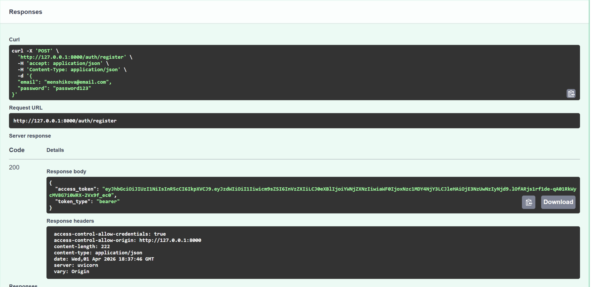
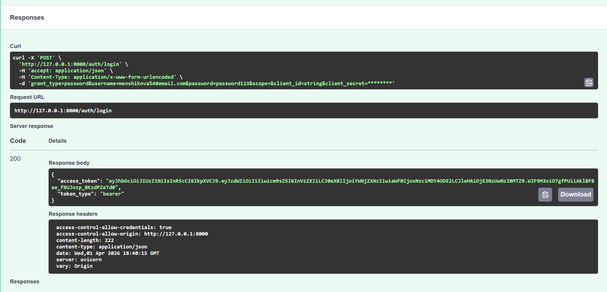
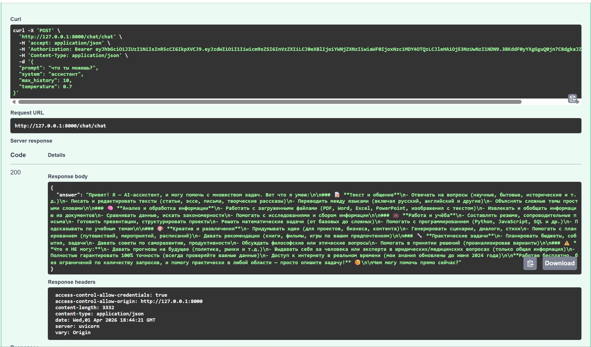
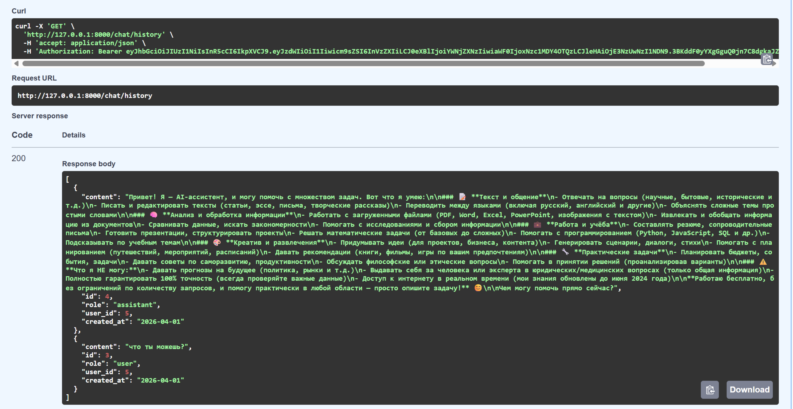
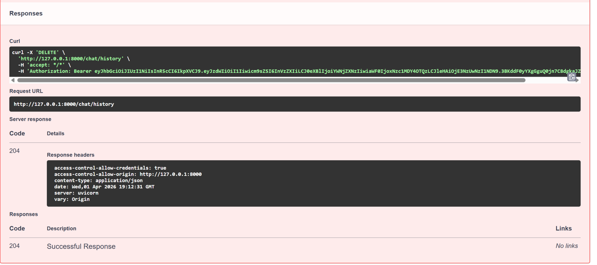

# LLM-P

FastAPI сервис с JWT аутентификацией, интеграцией с OpenRouter LLM и хранением истории диалогов в SQLite.

## Требования

- Python 3.11 или выше
- uv

## Установка и настройка

### 1. Установка uv

pip install uv

### 2. Клонирование репозитория

git clone <url-репозитория>
cd llm-p

### 3. Создание виртуального окружения

uv venv

### 4. Активация виртуального окружения

Windows:
.venv\Scripts\activate

Mac/Linux:
source .venv/bin/activate

### 5. Установка зависимостей

uv pip install -e .

### 6. Настройка переменных окружения

cp .env.example .env

Отредактируйте файл .env:

APP_NAME=llm-p
ENV=local

JWT_SECRET=your_super_secret_key_change_me
JWT_ALG=HS256
ACCESS_TOKEN_EXPIRE_MINUTES=60

SQLITE_PATH=./app.db

OPENROUTER_API_KEY=your_openrouter_api_key
OPENROUTER_BASE_URL=https://openrouter.ai/api/v1
OPENROUTER_MODEL=stepfun/step-3.5-flash:free
OPENROUTER_SITE_URL=https://example.com
OPENROUTER_APP_NAME=llm-fastapi-openrouter

### 7. Запуск приложения

uv run uvicorn app.main:app --reload --host 0.0.0.0 --port 8000

После запуска приложение доступно по адресу:
http://localhost:8000/docs

## Проверка кода

uv run ruff check

## Документация API

Swagger UI: http://localhost:8000/docs

Эндпоинты:

POST /auth/register - регистрация пользователя
POST /auth/login - вход в систему (OAuth2)
GET /auth/me - профиль пользователя (требуется токен)
POST /chat - отправка сообщения в LLM (требуется токен)
GET /chat/history - история диалога (требуется токен)
DELETE /chat/history - очистка истории (требуется токен)
GET /health - проверка статуса сервера

## Демонстрация работы

### 1. Регистрация пользователя

POST /auth/register
Content-Type: application/json

{
  "email": "menshikova@email.com",
  "password": "password123"
}

### 2. Логин и получение JWT

POST /auth/login
Content-Type: application/x-www-form-urlencoded

username=menshikova@email.com&password=password123

### 3. Авторизация в Swagger

Нажмите кнопку Authorize в Swagger UI и введите:
Bearer access_token

### 4. Отправка сообщения в чат

POST /chat
Authorization: Bearer <token>
Content-Type: application/json

{
  "prompt": "что ты можешь?",
  "system": "ассистент",
  "max_history": 10,
  "temperature": 0.7
}

Ответ:
{
  "answer": "Привет! Я — AI-ассистент, и могу помочь с множеством задач. Вот что я умею:\n\n### 📝 **Текст и общение**\n- Отвечать на вопросы (научные, бытовые, исторические и т.д.)\n- Писать и редактировать тексты (статьи, эссе, письма, творческие рассказы)\n- Переводить между языками (включая русский, английский и другие)\n- Объяснять сложные темы простыми словами\n\n### 🧠 **Анализ и обработка информации**\n- Работать с загруженными файлами (PDF, Word, Excel, PowerPoint, изображения с текстом)\n- Извлекать и обобщать информацию из документов\n- Сравнивать данные, искать закономерности\n- Помогать с исследованиями и сбором информации\n\n### 💼 **Работа и учёба**\n- Составлять резюме, сопроводительные письма\n- Готовить презентации, структурировать проекты\n- Решать математические задачи (от базовых до сложных)\n- Помогать с программированием (Python, JavaScript, SQL и др.)\n- Подсказывать по учебным темам\n\n### 🎨 **Креатив и развлечения**\n- Придумывать идеи (для проектов, бизнеса, контента)\n- Генерировать сценарии, диалоги, стихи\n- Помогать с планированием (путешествий, мероприятий, расписаний)\n- Давать рекомендации (книги, фильмы, игры по вашим предпочтениям)\n\n### 🔧 **Практические задачи**\n- Планировать бюджеты, события, задачи\n- Давать советы по саморазвитию, продуктивности\n- Обсуждать философские или этические вопросы\n- Помогать в принятии решений (проанализировав варианты)\n\n### ⚠️ **Что я НЕ могу:**\n- Давать прогнозы на будущее (политика, рынки и т.д.)\n- Выдавать себя за человека или эксперта в юридических/медицинских вопросах (только общая информация)\n- Полностью гарантировать 100% точность (всегда проверяйте важные данные)\n- Доступ к интернету в реальном времени (мои знания обновлены до июня 2024 года)\n\n**Работаю бесплатно, без ограничений по количеству запросов, и помогу практически в любой области — просто опишите задачу!** 😊\n\nЧем могу помочь прямо сейчас?"
}

### 5. Получение истории диалога

GET /chat/history
Authorization: Bearer <token>

### 6. Очистка истории диалога

DELETE /chat/history
Authorization: Bearer <token>

## Остановка приложения

Нажмите Ctrl + C в терминале.

## Структура проекта

llm_p/
├── pyproject.toml
├── README.md
├── .env.example
├── app/
│   ├── __init__.py
│   ├── main.py
│   ├── core/
│   │   ├── __init__.py
│   │   ├── config.py
│   │   ├── security.py
│   │   └── errors.py
│   ├── db/
│   │   ├── __init__.py
│   │   ├── base.py
│   │   ├── session.py
│   │   └── models.py
│   ├── schemas/
│   │   ├── __init__.py
│   │   ├── auth.py
│   │   ├── user.py
│   │   └── chat.py
│   ├── repositories/
│   │   ├── __init__.py
│   │   ├── users.py
│   │   └── chat_messages.py
│   ├── services/
│   │   ├── __init__.py
│   │   └── openrouter_client.py
│   ├── usecases/
│   │   ├── __init__.py
│   │   ├── auth.py
│   │   └── chat.py
│   └── api/
│       ├── __init__.py
│       ├── deps.py
│       ├── routes_auth.py
│       └── routes_chat.py
└── app.db# llm-p

